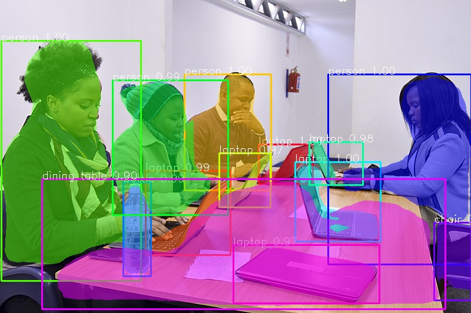
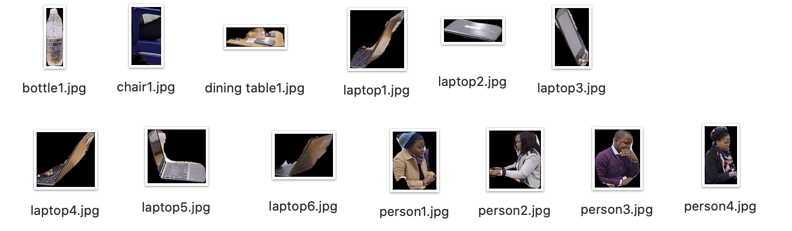
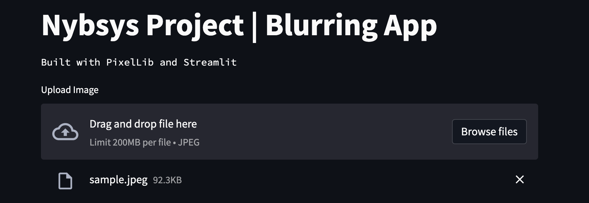

# Nybsys_Project

This project make use of the [PixelLib](https://github.com/ayoolaolafenwa/PixelLib) Library to segment objects and blurr the background. [Streamlit](https://streamlit.io/) is used as a frontend GUI. 

## Instance Segmentation

- Contains Two Folders  : "Input_Images"  and "Output_Images"
- The images to be segmented is to placed in the "Input_Images" Folder
- Capable of detecting and segmenting  80 different classes

| Original Image  | Segmented Image with Bounding Boxes |
|-----------------|-------------------------------------|
|    |                                      |

  

## Instance_Segmentation_Background_blurring

- Place a image named "sample.jpeg" in the root folder 
- Works with 20 different classes
 person, bus, car, aeroplane, bicycle, motorbike, bird, boat, bottle,  cat, chair, cow, dinningtable, dog,horse, pottedplant, sheep, sofa, train, tv
 
| Original Image  | Blurred Image |
|-----------------|-------------------------------------|
|    |                

## Instance_Segmentation_Extract_Objects

- Place a image named "sample.jpeg" in the root folder
- There will be a prompt asking the segmented image name

| Original Image  | Detected Objects |
|-----------------|------------------|
|                 |                     |

__**Segmented Objects**__

   

- bottle1.jpg
- chari1.jpg
- dining table1.jpg
- laptop1jpg
- laptop2.jpg
- laptop3.jpg
- laptop4.jpg
- laptop5.jpg
- laptop6.jpg
- person1.jpg
- person2.jpg
- person3.jpg
- person4.jpg

## Streamlit App
- Download the pre-trained h5 file [here](https://github.com/matterport/Mask_RCNN/releases/download/v2.0/mask_rcnn_coco.h5)
- Run the following command `` streamlit run app.py ``
- Upload or Drag and drop a "jpeg" image file 

  